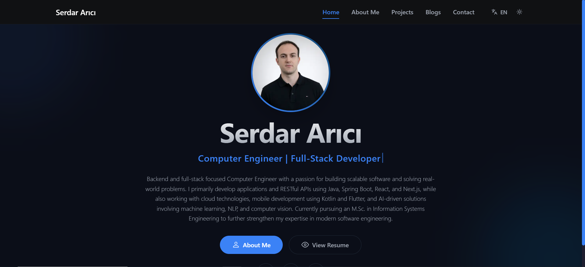
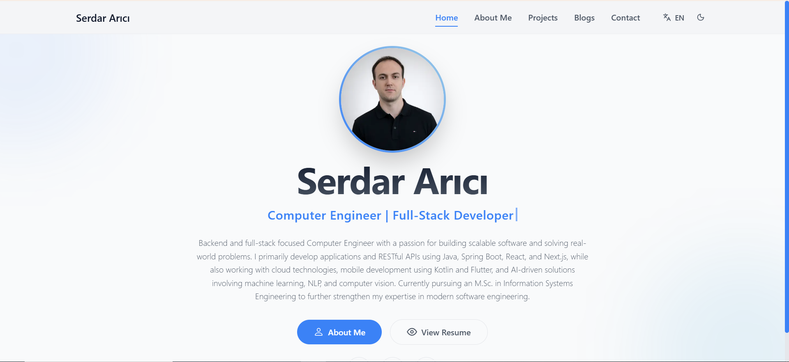
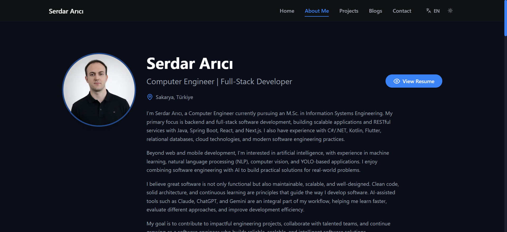
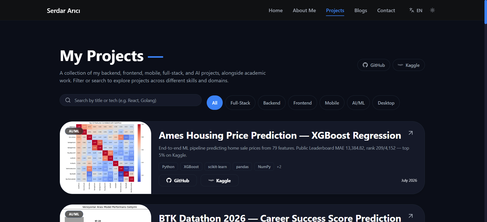
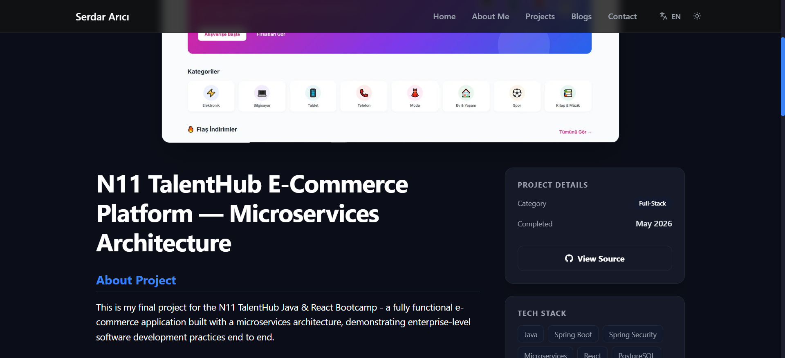
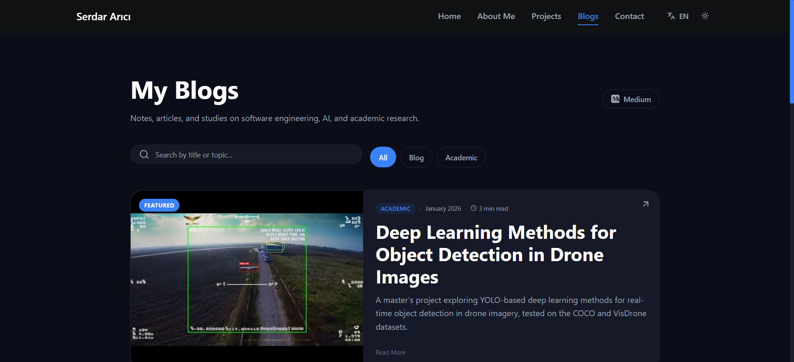
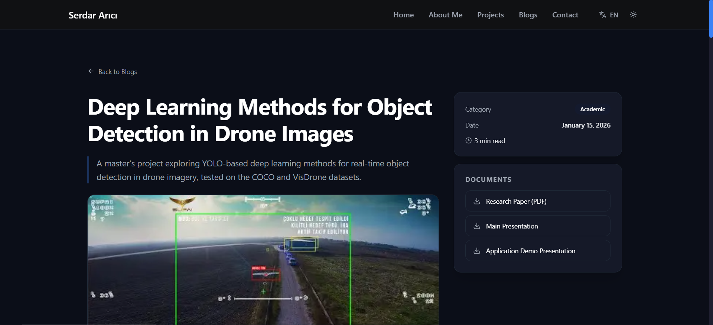
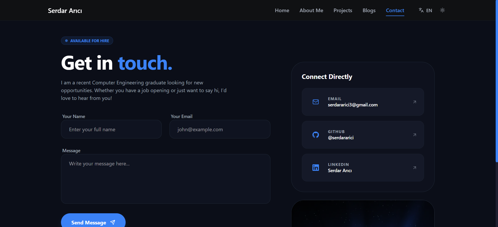

🇬🇧 English | [🇹🇷 Türkçe](./README.tr.md)

# Serdar Arıcı — Portfolio

A bilingual (TR/EN) personal developer portfolio built with Next.js (App Router), Supabase, and next-intl. It showcases projects, blog posts, work experience, education, skills, and certifications, with a Server Action-powered contact form.

### Live Demo

🔗 [serdararici.vercel.app/en](https://serdararici.vercel.app/en)

## Screenshots

### Home
| Dark | Light |
|---|---|
|  |  |

### About


### Projects


### Project Detail


### Blogs


### Blog Detail


### Contact


## Features

- **Multi-language support** (TR/EN) via `next-intl`, with locale-prefixed routing (`/en`, `/tr`)
- **Dark/Light theme** toggle powered by `next-themes`
- **Dynamic Projects & Blogs sections** sourced from Supabase, with static fallback data for projects
- **Category filtering and search** on the projects list
- **Markdown rendering** for blog content via `react-markdown` + `remark-gfm`
- **Image gallery with lightbox** (keyboard navigation, focus trap, scroll lock) on project and blog detail pages
- **Responsive design** across all pages, built with Tailwind CSS + DaisyUI
- **SEO metadata** per page via `generateMetadata` (OpenGraph + Twitter card support), plus `sitemap.ts` and `robots.ts`
- **Accessibility (a11y) considerations** — `aria-modal` on the gallery lightbox, `focus-visible` states on interactive elements, semantic markup

## Tech Stack

**Framework**
- [Next.js 16](https://nextjs.org/) (App Router, Turbopack)
- [React 19](https://react.dev/)
- [TypeScript 5](https://www.typescriptlang.org/)

**Styling**
- [Tailwind CSS v4](https://tailwindcss.com/)
- [DaisyUI v5](https://daisyui.com/)
- [Framer Motion](https://www.framer.com/motion/) — animations
- [next-themes](https://github.com/pacocoursey/next-themes) — dark/light theme switching

**Backend / Database**
- [Supabase JS v2](https://supabase.com/) — data reads via anon key
- [Resend](https://resend.com/) — contact form email delivery via a Next.js Server Action

**Other Libraries**
- [next-intl](https://next-intl.dev/) — i18n routing and translations
- [react-markdown](https://github.com/remarkjs/react-markdown) + [remark-gfm](https://github.com/remarkjs/remark-gfm) — blog markdown rendering
- [lucide-react](https://lucide.dev/) / [react-icons](https://react-icons.github.io/react-icons/) — icons
- [@vercel/analytics](https://vercel.com/docs/analytics) — usage analytics

## Project Structure

```
src/
  app/
    [locale]/          # All routed pages, wrapped in the locale segment (always present in the URL)
      about/            # About — parallel-fetches experience, education, skills, certifications
      blogs/[slug]/      # Blog list and blog detail pages
      contact/           # Contact form (Client Component + sendEmail Server Action)
      projects/[slug]/   # Project list and project detail pages
      layout.tsx         # Loads translations, wraps app with NextIntlClientProvider
      page.tsx           # Home page
    actions/            # Server Actions (sendEmail.ts)
    robots.ts           # robots.txt generation
    sitemap.ts          # sitemap.xml generation
  components/           # UI components, grouped by feature (about, blogs, projects, contact, layout, ui)
  lib/                  # Supabase client, data query functions, category maps, formatting utils
  data/                 # Static fallback data (used if Supabase is unreachable)
  types/                # Shared TypeScript types (Project, Blog, Experience, Education, ...)
  messages/              # next-intl translation files (en.json, tr.json)
  i18n/                  # next-intl routing and request config
```

## Getting Started

Clone the repository and install dependencies:

```bash
git clone https://github.com/serdararici/serdar-arici-portfolio.git
cd serdar-arici-portfolio
npm install
```

Create a `.env.local` file in the project root with the following variables:

```
NEXT_PUBLIC_SUPABASE_URL=
NEXT_PUBLIC_SUPABASE_ANON_KEY=
RESEND_API_KEY=
NEXT_PUBLIC_SITE_URL=
```

Then start the development server:

```bash
npm run dev
```

Open [http://localhost:3000](http://localhost:3000) to view the site.

## Database

Content is served from a Supabase Postgres database. Key tables:

- **`projects`** — title, category, description, tech stack, links (GitHub/live/Kaggle), gallery, and per-row Turkish translations (`*_tr` fields)
- **`blogs`** — title, summary, markdown content, cover image, gallery, related links (Medium/GitHub/YouTube), and per-row Turkish translations

Other tables (`experiences`, `education`, `skills`, `certifications`) power the About page.

## License

MIT License.

## Contact

- GitHub: [@serdararici](https://github.com/serdararici)
- LinkedIn: [linkedin.com/in/serdararici](https://linkedin.com/in/serdararici)
